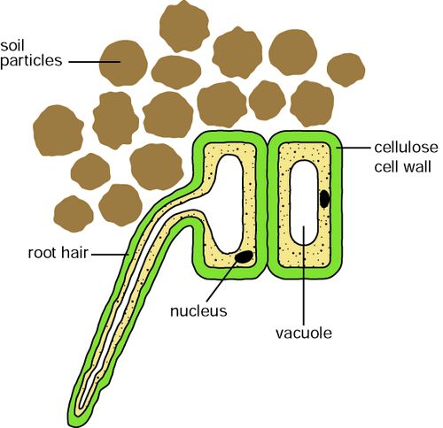

= Transport in Plants

toc::[]

== What do we need to transport?
- Mineral ions
- Water
- Glucose
- Gases
  * CO~2~
  * O~2~

== Water
Water is lost from the leaves.

Constant stream of: transpiration stream.

.Process
- Absorbed from the soil through osmosis.
* Has a low water potential due to the high concentration of minerals moved in
  through active transport from the soil.
* Moved through <<Xylem>> to other cells

NOTE: When fields flood the roots are starved of Oxygen so cannot do
      active transport so have a higher water potential than normal.

The water is moved by the pull of the water at the leaves on the
water at the roots.

.Uses
- Provides leaves the water for photosynthesis
- Carries mineral ions in solution
- Keeps cells turgid (structural)
- Cools leaf by allowing the evaporation of water removing heat

== Vascular (Transport) Tissues

All in the middle of root. Means the growing tip always has access to the
resources.

The xylem and phloem are surrounded by packing tissue cambium.

NOTE: In a root the xylem are in the center to provide support and as an anchor

NOTE: In a stem they are spread evenly around the center (in a ring) to provide
      support in wind.

=== Xylem
NOTE: Water is both cohesive (sticks to its self) and adhesive (sticks to other
      things). Due to this the xylem is a constant flow of water.

Dead

Water proof

One directional

They are the central core of the root tissue. Serves well to anchor
it to the ground (very strong).

Transports water and minerals

Completely hollow

=== Phloem
ALIVE!!!!!!!

Translocates sugars and food materials up and down the plant in the
form of sap.

NOTE: Moved by active transport so requires a lot of energy and has
      companion cells with a large number mitochondria (why they
      appear full)

== Root Hairs
Absorbs water.

Has a water proof root cap to protect the root as it grows into the ground

Specialised epidermis cells

Has a very thin cell wall

.Water Transport
. Mineral ions are transported into the cell by active transport
  (requires energy) to decrease the &Psi;.
. This means there is a steeper &Psi; gradient and water
  travels faster.

== Transpiration Stream
- Water evaporates from the leaves
- Moves up the xylem to replace it through adhesion and cohesion (requires unbroken column of water)
- Water moves from the from the roots to the stem
- This lowers the &Phi; in the root causing more water to enter the leaves.

Water intake in the root hairs causes a small amount of pressure. This and capillary action can push water up the xylem however is not powerful enough so the rest is trough transpirationn

=== Transpiration
The loss of water by evaporation from the leaves of the plant.

The presence of an impermeable waxy cuticle over the epidermis reduces water loss.

So the main loss is through the stomata

==== Measurement
.Weight Potometer
Simplest method is by using a weight potometer.

Assuming change in mass due to the water lost through transpiration

WARNING: The soil must be sealed off to ensure you don't measure the loss of water by evaporation from the soil.

Takes a long time to collect enough data.

.Volume Potometer

TODO: LOOK UP

image::http://cheppila.com/wp-content/uploads/2013/09/Transp-7.jpg[]

Method:

. Take a healthy, leafy shoot.
. Fill the whole apparatus with (under water).
. Introduce a small air bottle at the end of the capillary tubing.
. Cut steam under water at a slant (air bubbles less likely to get trapped).
. Place stem in potometer under water so air does not enter xylem vessels and break the transpiration flow.
. Allow time for the shoot to adjust to its surroundings.
. Open the top on reservoir to move air bubble to end of capillary tubing.
. Keep following the following conditions constant:
.. Light intensity
.. Temperature
.. Humidity
.. Air movement
. Take readings by timing how long it takes for the air bubble to travel a set distance along the tube.

=== Adaptions
.Thick waxy cuticle
- Cuts water loss
- Strengthens the leaf

- Water layer on outside of mesophyll cells.
- Water vapor.
- Diffusion H~2~O through stomata.
