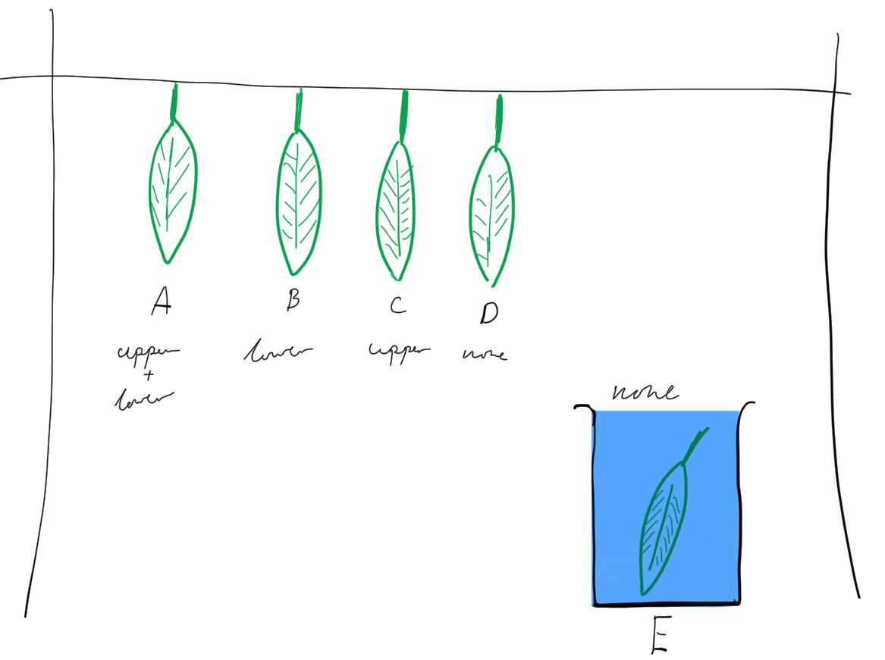

= Washing Line Experiment
Joshua Coles
Practical, Homework, $(date)
:stem:

== Aim
To determine the effect of blocking the stoma on transpiration in the plant.

== Diagram

== Method
. Setup the apparatus (without the leaves) as per the diagram
. Collect 5 leaves ensuring they remain attached to their stalks and use the
  labels to label them A-E.
. Apply vaseline as per the diagram with E having no vaseline applied.
. Measure and record the masses of the leaves to `2.d.p`.
. Attach the leaves A-D as per the diagram.
. Place leaf E in a small beaker of water.
. Leave setup for a week.
. Re-measure and record the masses of all the leaves.
. Calculate the percentage change in maths with the formula
  asciimath:[(change in mass / original mass) * 100]

== Results

.Results
[format="csv",options="header"]
|===================================================
include::results.csv[]
|===================================================

== Questions
[qanda]
What is the purpose of smearing vaseline on the leaves?::
  To seal the stoma in the leaves.

Which 2 leaves act as controls in this experiment? Why are they needed?::
  D and E. D is a normal leaf with nothing done to it and E is submerged in
  water. They are need to provide something to measure and compare the results
  against.

Where does the water in the leaves come from when they were attached to the plant?::
  The leaves would have come from the root (moved in through osmosis) and would
  have traveled up the xylem in the transpiration stream.

Give three uses for water in the leaf.::
  - Cooling.
  - Structural integrity.
  - Photosynthesis.

Why do we calculate the percentage changed instead of just the change in mass for each leaf?::
  As the percentage change gives us a value relative to the original mass of the
  leaf which can be compared against other leaves.
