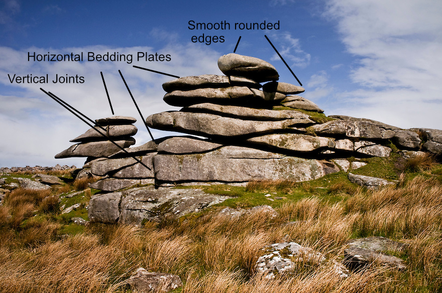

= Granite Tors

== What is it?
A large free-standing rock outcrop rising above the surrounding landscape.
It is made when a batholith intrudes into the crust however the softer
country rock is eroded/weathered away with time. The cracks form when the rock
is cooling and contracting and when it is un-convered and the pressure released.
These are then amplified by freeze thaw weathering.

== Where are they commonly found?
Common in:
  - Dartmoor
  - Bodmin moor

== Joints

Unloading:: Joints formed near the surface by uplift and erosion.
Cooling:: Columnar (perpendicular) joints that result from the cooling of lava.

Formed by freeze, thaw weathering
