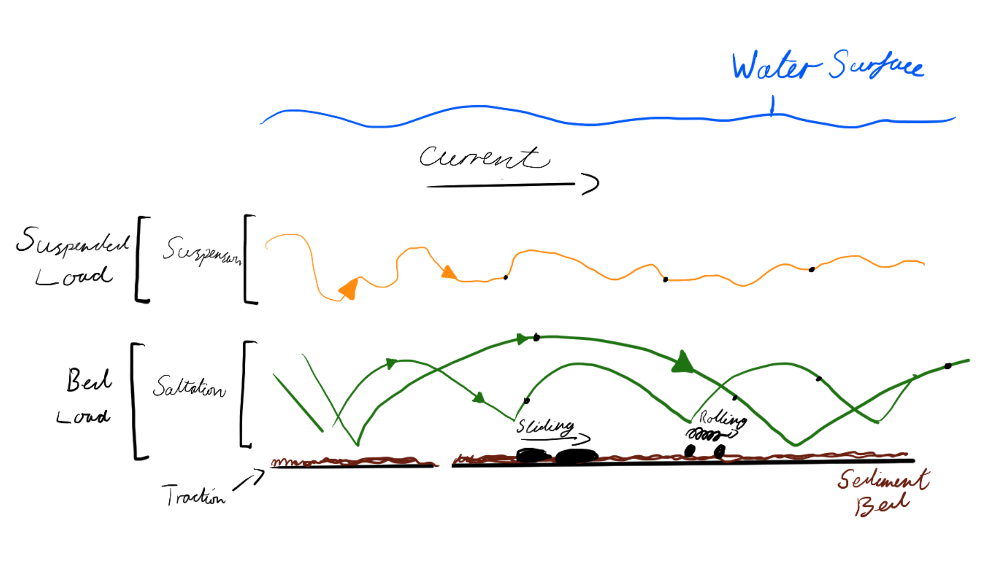
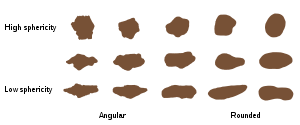
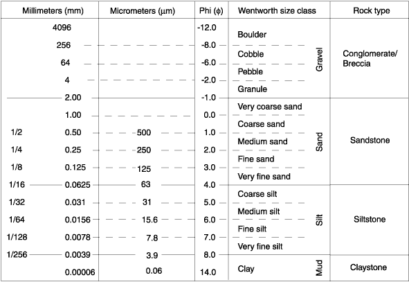

= Sediment Transport

When material is weathered away some of it is transported from where it was
originally.

The methods of transport are:

Gravity:: Moves loose weathered sediment down slopes.
Wind:: Lifts and transports finer grained sediment.
Rivers:: Lift and transport sediment of all sizes and grains.
The Sea:: Moves all types of sediment.
Ice:: Depends on climate. +
      Can carry large amounts of large rock debris.

Sediment grains can cause *abrasion* in rocks they move over wearing them down.

The sediment can also wear down other sediment in a process called *attrition*,
this is caused by the grains rolling, rubbing and being crushed together in
transport. With *attrition* the rocks become small and more rounded. The harder
minerals such as quartz will outlast the weaker ones such as mica which will be
crushed by this process.

== Methods of transport

.Figure 1 Methods of sediment transport in water.

NOTE: Most of these also apply to wind, however wind does not carry in solution.

The maximum grain size that can be carried by the water is determined by the
velocity of the water.

*Bed loads* consist of larger grains that are moved by *traction* and smaller
grains that bounce along the bed by *saltation*.

Finer grains don't touch the bed are in the *suspended load*. Soluble minerals
are transported in solution sand are invisible.

Grains become smaller the longer they have been in transit.

Clay sized particles require high velocities for erosion due to their flat,
platy shape and cohesive nature. Clay particles remain suspended even in low
currents due to their low mass and buoyancy.

== Grain shape and Roundness

The shape is dependent on the type of rock or mineral that they are comprised of.

One way to compare the grain is to a sphere.

== Grain Size

Measurement and classification of grain size is done through the Wentworth-Udden
scale.

TIP: The Wentworth-Udden scale is logarithmic not linear!

The grain size is the average diameter of all the grains of sediment in a rock.

The &phi; scale is used as a replacement for mm as shown below:

