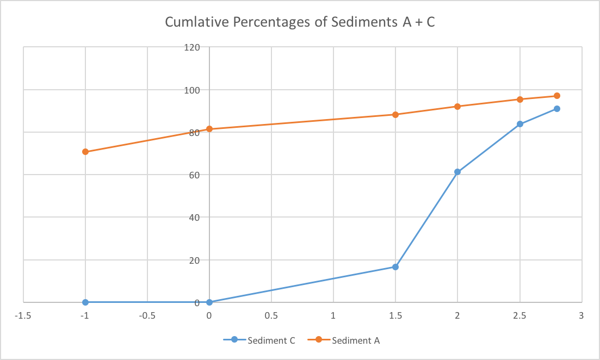

= Calculating the Sorting of a Sediment =
Joshua Coles <josh@coles.to>
$(date)
:stem:

== Equipment
- Sieves
- Balance
- Funnel
- Beaker
- Stop watch

== Method
. Repeat for 2 sediment types:
.. Collect `50g` of a sediment after stirring the main batch.
.. Check the sieves are clean and correctly ordered.
.. Pour the sediment into the top of the sieve stack.
.. Shake continuously for to `2 minutes`.
.. Carefully separate the sieves recording the masses in each section.
.. Return the sediment and stir the main batch.
. Complete the table.
. Plot the cumulative percentages.
. Calculate the coefficient as shown below.

[asciimath]
++++
(Phi_84-Phi_16)/2
++++

.Sorting Classification
[format="csv",cols="",options="header"]
|===================================================
include::coefficient_classification.csv[]
|===================================================

== Results
.Sediment A
[format="csv",cols="",options="header"]
|===================================================
include::sediment_a.csv[]
|===================================================

.Sediment C
[format="csv",cols="",options="header"]
|===================================================
include::sediment_c.csv[]
|===================================================

