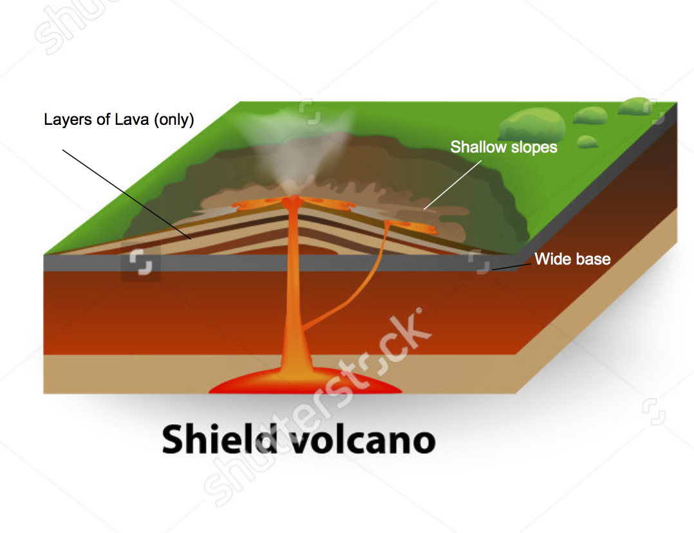
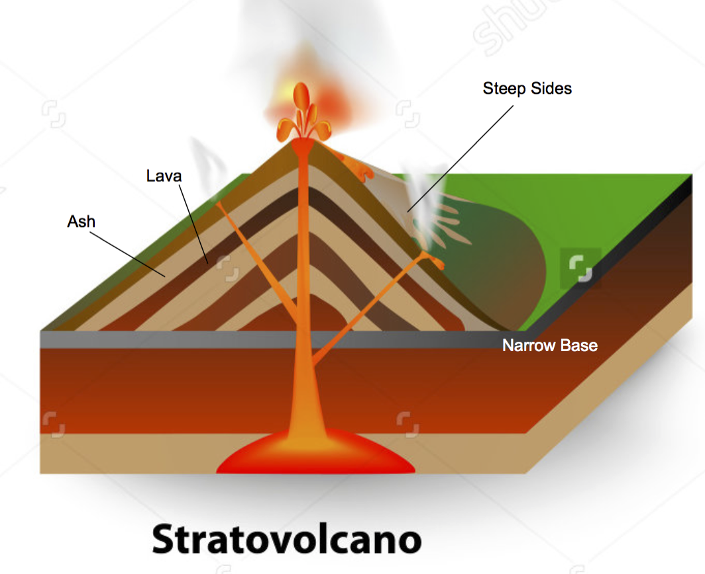

= Viscosity of Lava

== Temperature
The higher the temperature the lower the lower the viscosity

== Crystal Content
The higher the volume of solid being carried the higher the viscosity.

== Gas Content
The higher the volume of gas in the fluid the lower the viscosity.

NOTE: If the gases get trapped in a viscous magma the pressure of gas can build
      up causing an eruption.

== Water Content
The higher the volume of water the lower the viscosity.

== Composition
The higher the proportion of silica the higher the viscosity.

[options="header"]
|=========================================================================
| Magma Type | Example  | Relative Viscosity | Volcano Type | Volcano Name
|  Silicic   | Rhyolite |    Higher          |  Explosive   | Strato
|   Basic    |  Basalt  |    Lower           |   Effusive   | Shield
|=========================================================================

=== Shield-volcanoes (Effusive)
Wide, low and shallow due to how far the extremely un-viscose, basic, lava
travels before cooling.

.Example 5.1.1: Shield-volcano

=== Stratovolcanoes (Explosive)

Shaped due to the highly viscose, silicic, lava and the eruption process.

.Eruption Process
. Vent is blocked.
. Gases build up causing pressure to rise.
. This causes a violent eruption when the pressure becomes to much for the plug
  to bear.
. As the magma/lava cools it forms a new plug repeating the process.

.Example 5.1.2: Stratovolcano

