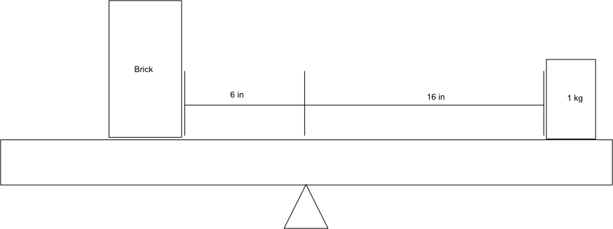
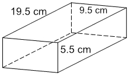

= The Physics of Brick =
Joshua Coles <josh@coles.to>
$(date)

The mass of the brick was determined by using a 1kg mass, a pivot and a ruler.

.Relative pivot scales

[asciimath]
++++
1 * 16 = m_b * 6
++++

[asciimath]
++++
m_b = 16/6 = 2.67kg
++++

.Brick

[asciimath]
++++
V = 0.095 * 0.055 * 0.195 = 1.02 * 10_(-3)m^3
++++

The density of the brick is given by equation asciimath:[rho = m/V].
[asciimath]
++++
rho = m/V = 2.67/1.02 * 10^(-3) = 2617kgm^(-3)
++++

The weight of the brick is given by the equation asciimath:[W = mg].
[asciimath]
++++
W = mg = 26.7N
++++

The pressures are:

.Side AB
[asciimath]
++++
p = F/A = 26.7/(0.095 * 0.055) = 5,110 \ Pa\ (3.s.f)
++++

.Side AC
[asciimath]
++++
p = F/A = 26.7/(0.095 * 0.195) = 1,440 \ Pa\ (3.s.f)
++++

.Side BC
[asciimath]
++++
p = F/A = 26.7/(0.055 * 0.195) = 2,490 \ Pa\ (3.s.f)
++++
